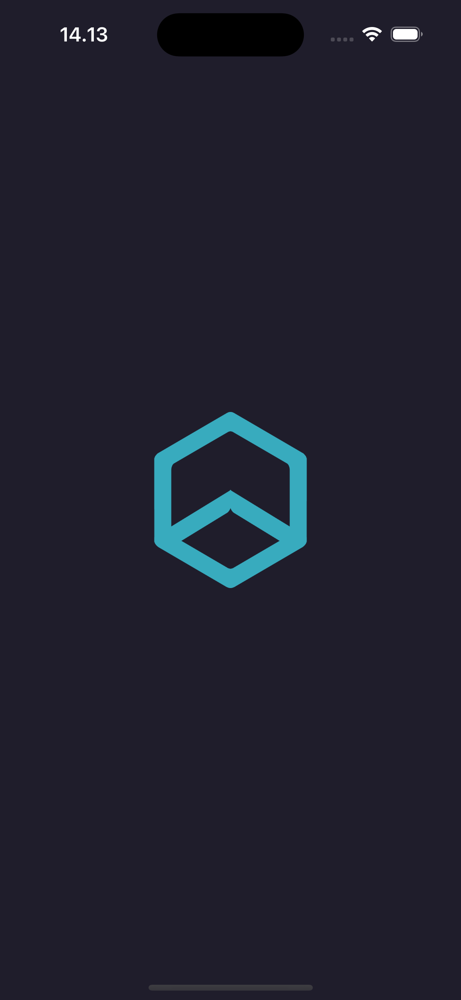
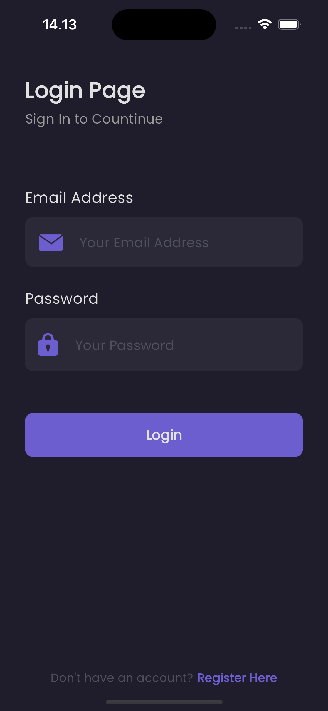
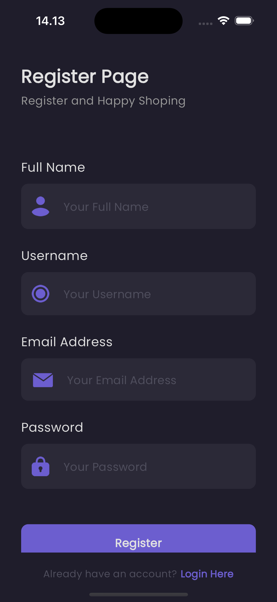
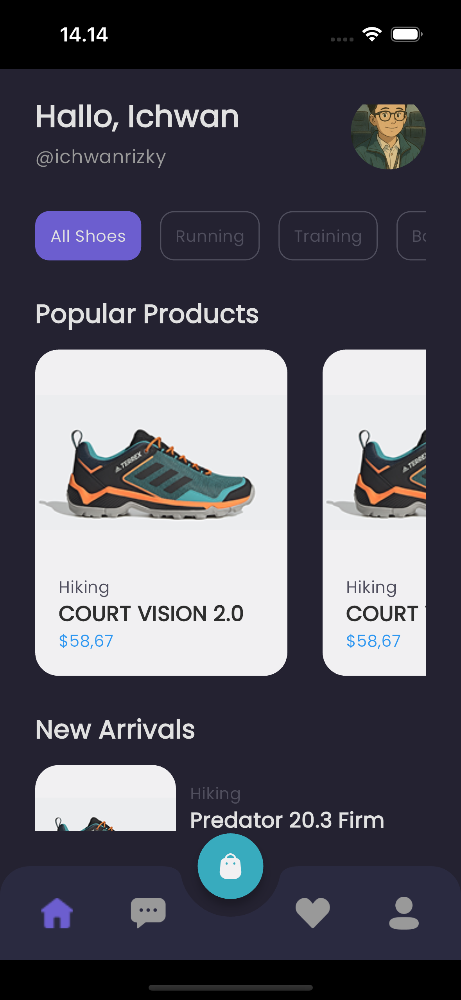
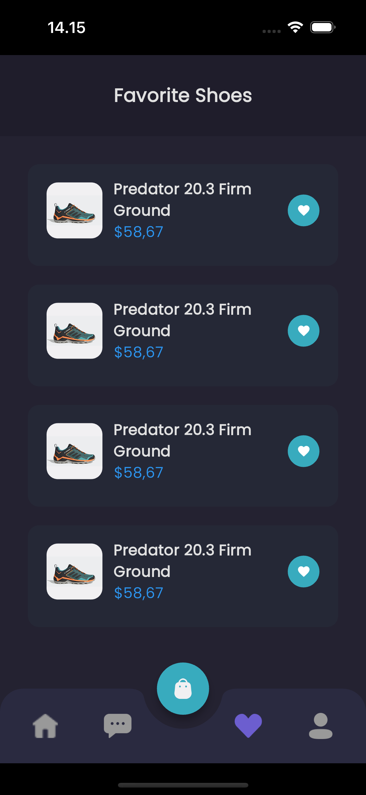
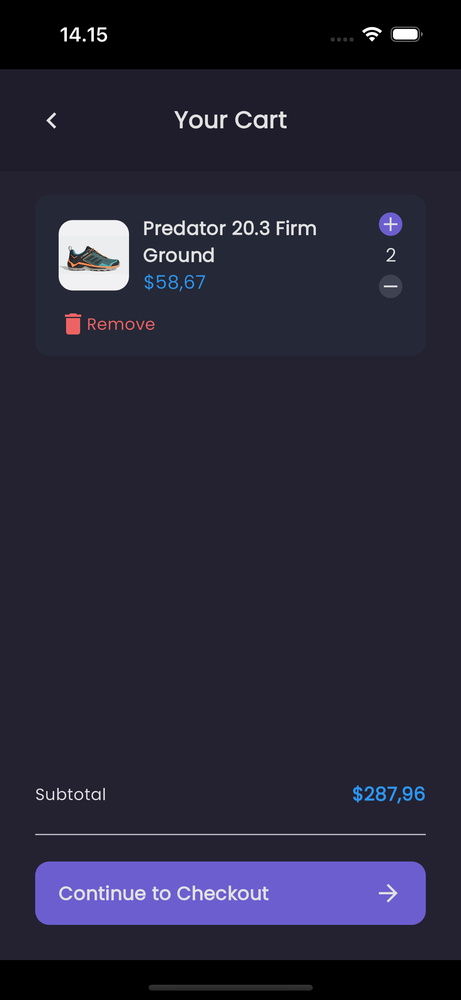
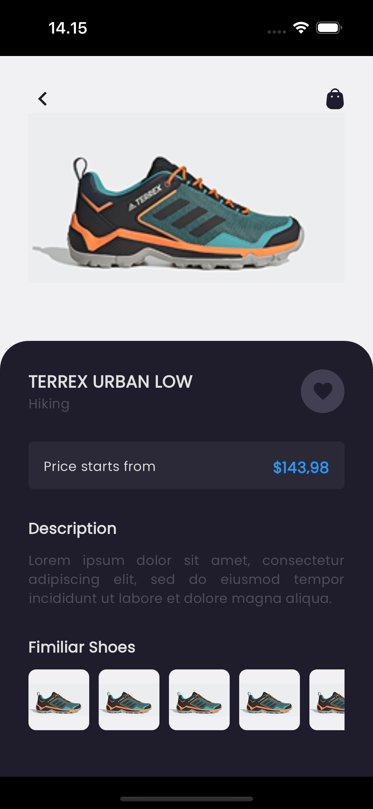
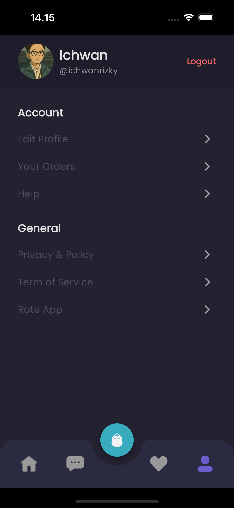

# Flutter E-Commerce Shoes

A beautifully designed and responsive e-commerce mobile app built using Flutter, focused on selling shoes with a clean and modern UI. This project is part of my portfolio to showcase frontend mobile development skills using Flutter and custom UI implementation.

---

## 📦 Available Versions

| status      | Folder         | Description                                          |
| ----------- | -------------- | ---------------------------------------------------- |
| ready✅     | `ui_version/`  | Flutter app with fully designed UI (no backend)      |
| coming soon | `api_version/` | Flutter app connected to backend API (Next.js) – WIP |

---

## 📱 Screenshots

| Splash                               | Login                              | Register                                 | Home                             | Chat                             |
| ------------------------------------ | ---------------------------------- | ---------------------------------------- | -------------------------------- | -------------------------------- |
|  |  |  |  |  |

| Favorite                                 | Cart                             | Detail                                      | Profile                                |
| ---------------------------------------- | -------------------------------- | ------------------------------------------- | -------------------------------------- |
|  |  |  |  |

---

## ✨ Features

- ✅ Splash screen
- ✅ Login & Register page
- ✅ Bottom navigation bar with custom icons
- ✅ Product listings: Popular & New Arrivals
- ✅ Product detail page
- ✅ Cart UI + quantity handler
- ✅ Address & Checkout summary
- ✅ Payment breakdown
- ✅ Empty state (Cart & Chat)
- 🔄 Backend API integration (Next.js) – _coming soon_

---

## 🛠️ Tech Stack

- **Flutter** (v3.19.x)
- **Dart**
- **Google Fonts**
- **Custom UI components & icons**
- **Next.js** (for API integration – coming soon)

---

## 🙋‍♂️ Author

**Mohammad Ichwan Rizky Kurnia**  
💼 Full-Stack Developer (Flutter · PHP Native · Next.js)  
📍 Indonesia  
📫 GitHub: [@ichwanrizky](https://github.com/ichwanrizky)
📫 LinkedIn: (https://www.linkedin.com/in/ichwan-rizky-67ba101b3)

I build modern and scalable applications for mobile & web. Currently focusing on improving my frontend skills and building strong personal branding through portfolio projects like this.

---

## 📄 License

This project is licensed under the MIT License.  
See the [LICENSE](LICENSE) file for more details.
